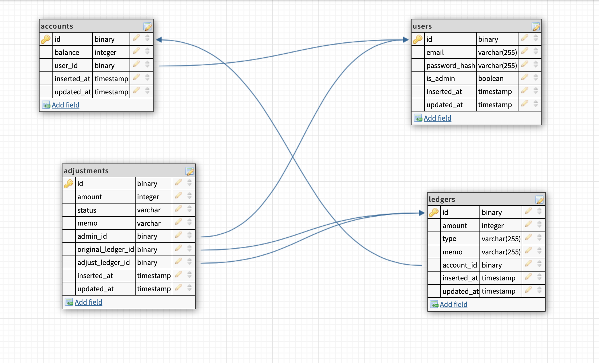

# CyptoBank

## Intro
CyptoBank is a simple banking API system designed to meet all project requirements,
created in Elixir, using Phoenix web framework, all endpoints return API in JSON
format.

## Features
  * Create user accounts with Email and password
  * Create admin/operation team accounts with Email and password
  * Create mutiple banking accounts for a user, simulate real world multiple
    account for a user, thinking saving and cash account, etc.
  * User account can deposit to account owned
  * User account can withdrawal from account owned, with balance limit safety check
  * User account can transfer to another account, owned by self or others, with
    balance limit safety check
  * User can request an amount adjustment to previous deposit or withdrawal transaction
  * Admin/operation user can see all adjustments required
  * Admin/operation user can approve adjustments if adjustments meet safety
    requirement

## CyptoBank RESTful API
  * Shared Postman API collections link: https://www.getpostman.com/collections/fbe6519933e168dffea0
  * Postman auto generated API docs: https://documenter.getpostman.com/view/3036697/TVYGbHQa
  * An export collections of API from Postman in JSON can also be found in
    project root folder, name: cypto_bank.postman_collection.json

## Design, code and TODO
  * CyptoBank is created over the weekend with heart, as creator I fully intent
    to make the project as good as possible, however, two days are relative
    short to make a perfect banking system, hence, there are features, code
    improvement, documentation and tests that need to be improved, which
    includes but not limits to:
    - most of time has been spend on achieving a robust banking system and
      features that required, unfortunately I don't have enough time left to
      write more tests, currently all business logics are test covered, the only
      part that hasn't completed is controller, increase CyptoBank test coverage
      is my current task.
    - currently, user authentication is session based, with simple but secure user
      authentication method, using email and hashed password, with session
      renew. If with more time, I would prefer implement token based
      authentication system, like JWT/OAuth. But, I'm not suggesting token based
      authentication is superior than session based, both methods can create
      sound account security.
    - routes in current version should be replaning, and currently
      authentication functions are not centrally located in a Plug, which is
      usually a good idea, again, given time limited, I should improve on this
      later.
    - currently, money amount related fields are stored in integer in db level, which I do
      think is a good data type for banking when compares to decimal, decimal in
      db level might well create unsafe situations and hardship for
      productivity. But because money now stores as integer, do need future
      improvement on format and display, well, since this is an pure backend API
      system, this shouldn't too harsh, for extreme, all the formating can leave
      to frontend.
    - in current version, API returns are not in a standardized view format like
      JSON:API, I kept success responds in a simple but uniformed view, which is
      ok, the place that requires future improvements are in error and exception
      views, for example, further normalization of fallback error view with
      standardized error message, code format should be introduced.
    - most of the controller modules are small, which is followed by the lean
      controller principle, might need some works to make it leaner.
    - current contexts design are not ideal, for examples, both User and Account
      are located in the same Accounts context, which is not great, future me
      should separate them into Account and User or Profile context, so to
      separate security and feature functionality.
    - naming is hard, I made some mistake that I wish to amend, in Transactions
      context, I named the schema as Ledger, but named the contextual interface
      as Transaction, which essentially are the same, this might create
      confusion.
    - one of the requirements is fix a deposit or a withdrawal, I'm not fully
      sure the intent features, and due to it's
      weekend, I rather not bother others in the team, so I create the scenario
      for this as: when client has made an successful transaction of deposit or
      withdrawal, but later decide it's not the correct amount, client need to
      create an Adjustment application with the correct amount, then
      admin/operation user can view the list of adjustments requests from an
      adjustment endpoint, admin then can decide how to process the adjustment,
      approve, decline or keep pending, on approve, system will do a safety
      check on account balance, only can be approved by admin if adjustment
      passed the safety check. Currently, the decline function has not been
      assign an endpoint yet.
    - The core banking functions, deposit, withdrawal, transfer, account
      balance and adjustment are all handle using Ecto.Multi Transaction, as
      name suggest, it's very well suit to handle banking transactions, as
      banking transaction almost always involves multiple
      books/accounts/parties, a successful transaction should only be performed
      at the same time when all books/accounts success, so to avoid imbalance/corruption of
      books. CyptoBank uses Ecto.Multi to ensure this. If a transaction fail in
      any steps, an step specific error message will return, transaction will
      stop, and previous steps will be rolled back within Multi, no corruptions
      to the books.
    - in the future when time is not limited, I should create an separate module
      for the transaction sub steps, currently they all located in Transactions
      contextual interface.
    - now CyptoBank is still a very tiny project, the project structure is still
      ok, but in the future, it maybe worth to separate queries, schemas of each
      context into their own module.
    - CyptoBank.Helpers.Query is created for previous projects, and I do realize
      now it doesn't be used much, I will remove it, good code is the code that
      not in the project.

## ERD
  

## Run project
  * Install dependencies with `mix deps.get`
  * Create and migrate your database with `mix ecto.setup`
  * Start Phoenix endpoint with `mix phx.server` or with IEx `iex -S mix phx.server`

Now you can visit [`localhost:4000`](http://localhost:4000) from your browser.

